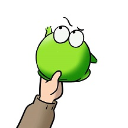
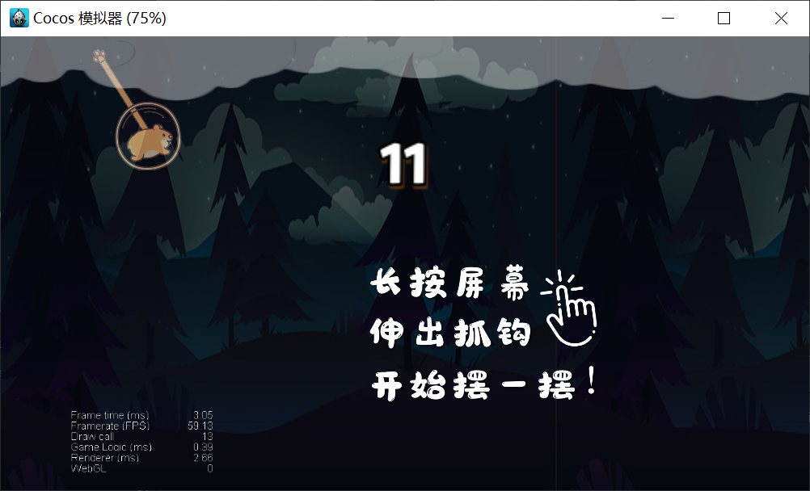
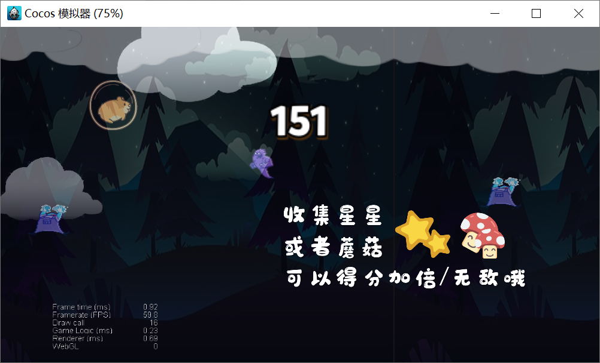
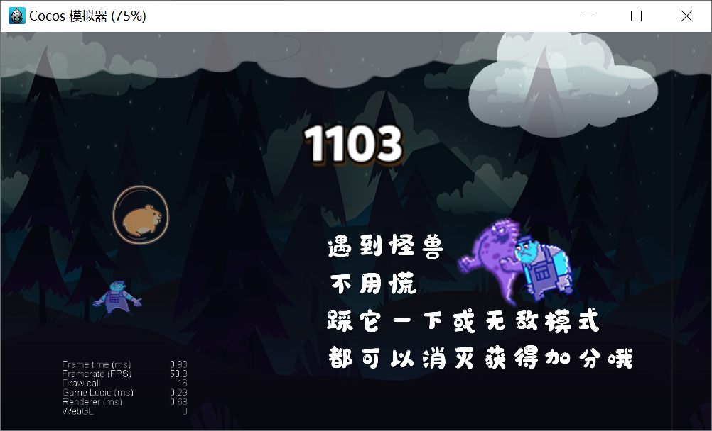

# Hamswing

Xinwei Zhang

- 2016010151
- [xw-zhang16@mails.tsinghua.edu.cn](xw-zhang16@mails.tsinghua.edu.cn)
- [https://github.com/zhangxwww](https://github.com/zhangxwww)

Yuanbiao Wang

- 2016010327
- [wang-yb16@mails.tsinghua.edu.cn](wang-yb16@mails.tsinghua.edu.cn)
- [https://github.com/agil27](https://github.com/agil27)

github repo：

- [https://github.com/zhangxwww/hamswing](https://github.com/zhangxwww/hamswing) (main body)
- [https://github.com/agil27/hamswing-sub](https://github.com/agil27/hamswing-sub) (subdomain)

Wechat mini-app QR code

---

## How to play

In this game, you will impersonate as a hamster, using your contractable claw to jump through the forest.

Tap the screen and hold to reach out your cord and claw; release to withdraw the cord and fly by gravity.

Collect the star to score double; Collect the mushroom to become invincible

If you touch the monster while you are invincible or you trek on the monster head, you will kill it; otherwise you will be killed

## Reference

[1\] [Cocos Creator v2.0 user manual](https://docs.cocos.com/creator/manual/zh/)

[2\] [Cocos Creator JavaScript engine API reference](https://docs.cocos.com/creator/api/zh/)
